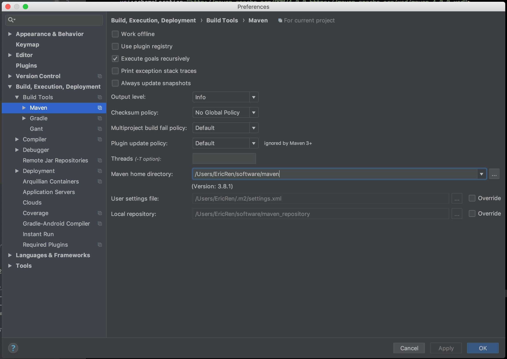

# 1. M2_HOME 目录分布
```shell
total 64
-rw-r--r--@  1 EricRen  staff    17K 11  7  2019 LICENSE
-rw-r--r--@  1 EricRen  staff   5.0K 11  7  2019 NOTICE
-rw-r--r--@  1 EricRen  staff   2.6K 11  7  2019 README.txt
drwxr-xr-x@  8 EricRen  staff   256B 11  7  2019 bin
drwxr-xr-x@  4 EricRen  staff   128B 11  7  2019 boot
drwxr-xr-x@  5 EricRen  staff   160B  7  23 00:42 conf
drwxr-xr-x@ 65 EricRen  staff   2.0K 11  7  2019 lib
```
1. **bin目录**：目录中包含了Unix平台以及Windows平台下的脚本文件，还包含两个平台下的 mavenDebug 脚本文件，另外还包含了 m2.conf 文件，这是 classworlds 的配置文件。
2. **boot目录**：该目录只包含一个文件，以maven3.8为例，该文件为`plexus-classworlds-2.6.0.jar` ，这是一个类加载器框架，maven使用该加载器加载自己的类库。
3. **conf目录**：该目录包含了一个非常重要的 `settings.xml` 文件。一般情况下，我们更倾向于复制该文件到 `~/.m2/settings.xml` ，修改该文件，可定制 Maven 的行为。
4. **lib目录**：该目录包含了所有 Maven 运行时需要的 Java 类库。可以说，lib 目录就是阵子的 Maven。用户可以在这个目录找到 Maven 内置的超级 POM 。

# 2. ~/.m2
先运行一条指令：
```shell
mvn help:system
```
该命令会打印所有的Java系统属性和环境变量。运行这条命令的目的是让 Maven 执行一个真正的任务。我们可以看到 Maven 会下载 `maven-help-plugin`，包括 pom 文件和 jar 文件。这些文件都被下载到了 Maven 本地仓库之中。

# 3. 设置HTTP代理
需要在 `settings.xml` 中新增 proxies 属性配置：
```xml
<settings>
  <proxies>
    <proxy>
      <id>my-proxy</id>
      <active>true</active>
      <protocol>http</protocol>
      <host>10.2.3.40</host>
      <port>3128</port>
      
      <!--
      <username>username</username>
      <password>PASSWORD</password>
      <nonProxyHosts>repositroy.mycom.com|*.google.com</nonProxyHosts>
      -->
    </proxy>
  </proxies>
</settings>
```
这段配置十分简单,`proxies` 下可以有多个`proxy`元素，如果申明了多个`proxy`元素，则默认情况下第一个被激活的 `proxy` 会生效。
`nonProxyHosts` 元素用来指定哪些主机名不需要代理，可以使用”`|`“符号来分隔多个主机名。此外，该配置也支持通配符匹配。

# 4. 设置 MAVEN_OPTS 环境变量
通常需要设置`MAVEN_OPTS`的值为`-Xms128m -Xmx512m`，因为Java默认的最大可用内存往往不能满足 Maven 运行时的需要。

关于环境变量，请参考前面设置 M2_HOME 环境变量的做法，尽量不要直接修改 `mvn.bat`或者`mvn`这两个maven脚本。

# 5. 配置用户范围 settings.xml
Maven 用户可以选择配置 `$M2_HOME/conf/settings.xml` 或者 `~/.m2/settings.xml`，前者是全局范围，后者是用户范围（只有当前用户才受到该配置的影响）。

推荐设置用户范围级别的 settings.xml。
``
# 6. IDEA 使用外部 Maven


推荐使用外部 Maven，不要使用 IDE 自带的 Maven 。